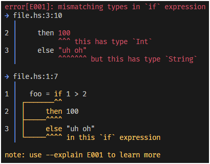

# Errata

**Errata** is an extremely customizable error pretty printer that can handle many kinds of error formatting. For example, it can handle errors that are all over the source or errors that are connected to each other spanning multiple lines. You can be as simple or as fancy as you like!  

You can also customize the format of the printer in several ways:  

- Custom messages and labels
- Custom character sets for symbols
- Highlighting the source, messages, and symbols

Here is an example of a pretty error message from **Errata**:  

